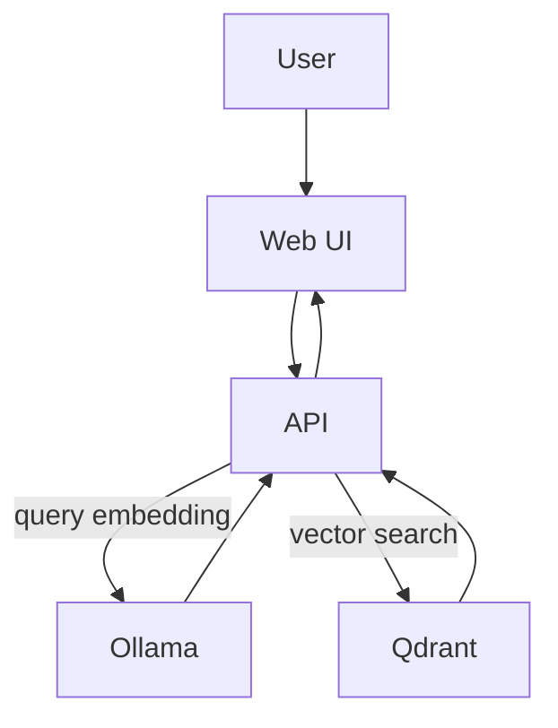

# Wiki and then some LLM (poc)

**Build a local Retrieval-Augmented Generation (RAG) pipeline** using a Wikipedia snapshot and your own custom documents — no external APIs required.

## Modules 
- **Ingest Wikipedia + custom docs** into a vector database
- **Local embeddings & LLM** via [Ollama](https://ollama.ai)
- **Vector storage & search** with [Qdrant](https://qdrant.tech)
- **REST API** for queries
- **Web UI** with a clean input box + results view
- **Docker Compose** setup for reproducible environments

## Quick Start

```bash
# 1. Clone repo
git clone https://github.com/Lewkow/Wiki_and_then_some_LLM.git
cd Wiki_and_then_some_LLM

# 2. Download Simple English Wikipedia dump
./wikapedia/download_wiki.sh

# 3. Start stack
docker compose up --build

# 4. Ingest (one-shot job)
docker compose run --rm ingest

# 5. Open the web UI
http://localhost:8080
```

## Components
- **`ollama`** → runs embedding + LLM models
- **`qdrant`** → stores embeddings and enables semantic search
- **`ingest`** → parses wiki/docs, chunks text, creates embeddings, stores in Qdrant
- **`api`** → FastAPI service exposing a RAG query endpoint
- **`web`** → Nginx serving a minimal UI to test queries

## Example Query

```bash
curl -s -X POST http://localhost:8000/query \\
  -H 'content-type: application/json' \\
  -d '{"query":"What is Simple English Wikipedia?", "top_k": 3}'
```

Response:
```json
{
  "answer": "Simple English Wikipedia is a version of Wikipedia written in simpler language.",
  "sources": [...]
}
```

## Architecture



## Repo Structure
```
├── api/         # FastAPI service
├── ingest/      # Wikipedia/custom docs ingestion
├── web/         # Simple HTML/JS frontend
├── scripts/     # Utilities (e.g., get_simplewiki.sh)
├── data/        # Wiki dump & user docs
└── docker-compose.yml
```

## License
MIT — use freely, credit appreciated.
